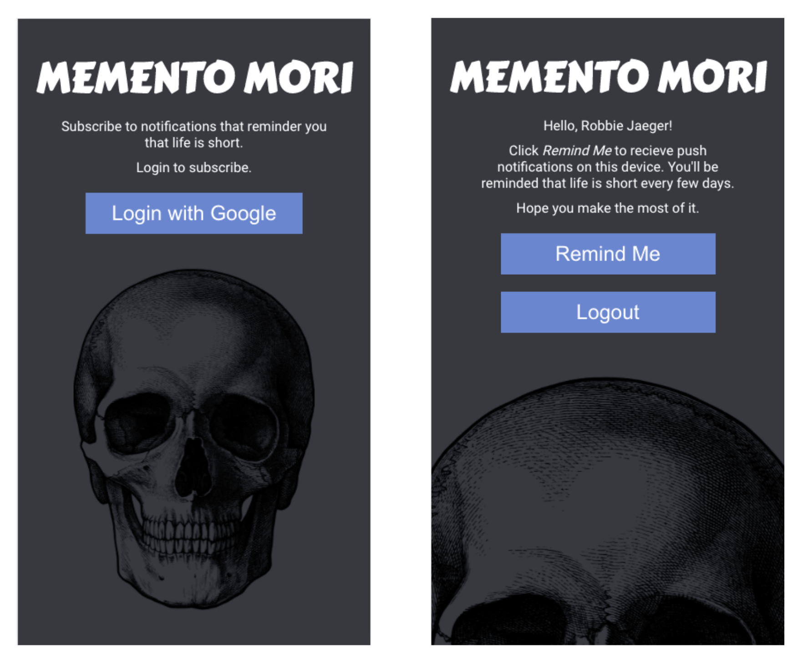

# Memento Mori - A Reminder of Your Own Mortality

Inspired by the [WeCroak](https://www.wecroak.com/) app.

Sign up to receive push notifications at somewhat random intervals of time (between 4 and 14 days) that say "A reminder that you aren't going to live forever." - a reminder to make the most out of life.

---

### Learning Goals

I wanted to learn about implementing the [Push API](https://developers.google.com/web/ilt/pwa/introduction-to-push-notifications) PWA technology. So it was important to have an application that would need to send push notifications even if the app is not open and active.

Items that were not learning goals:

* No offline caching through the service worker
* Keep file structure simple with no bundler/build tools

### App Features

* User sign's in via Google Auth (using Firebase)
* Requests permission from the user for Push Notifications in their browser window
* Gets subscription object from user's browser and saves that object to the DB along with their Google UID
* Backend sends a notification event to the client's browser using Web Push API (currently triggered via endpoint on the server, `/sendapush`)

### Features - In Progress

* Add relevant information and image to the push notification for this app
* Handle what happens when the push notification is clicked
* Add scheduled, random push notifications to users from the server (possibly using Bree library)
* User can unsubscribe from push notifications
* Add app manifest to enable PWA home screen icon
* Consider a strategy for multiple devices under the same user account
